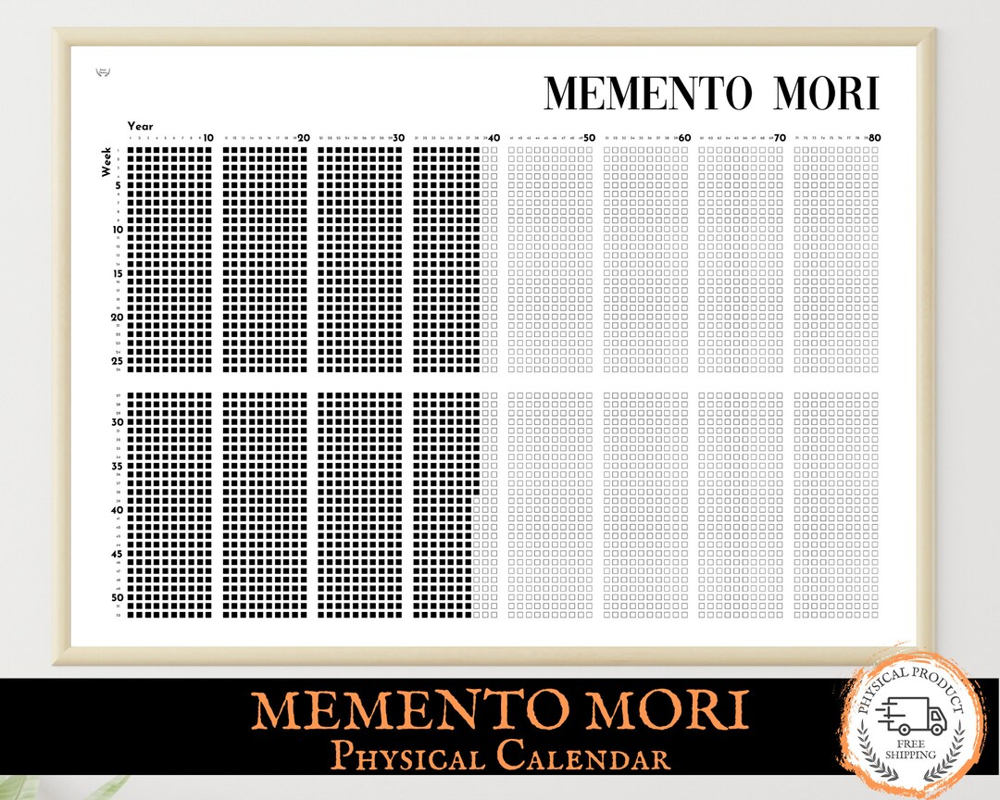

# Maybe it is the Damn Phone
## How to quit Doomscrolling and why you NEED to

---

## Who Am I? Why This Talk?

- I’m Nathan (sometimes Starbucks spells it “Naethin”)
- You already know most of what I'm going to say
- My goal: Make you Angry (and hopeful) enough to Change

---

## Audience Check-In

- How many of you doomscroll more than you want to?
- Who’s tried to quit or cut back?
- How many have relapsed or reinstalled?

---

## Self-Audit: Your Phone Habits

- How soon after waking do you check your phone?
- How many times do you unlock per day? 
- Does not checking your phone for an hour or more make you anxious or restless?
- Do you check your phone in places you know you shouldn’t? (Class, conversations, etc.)
- Do you ever lose hours to your phone, “by accident”?

---
## Nicotine Addiction Questions

| **Nicotine Dependence (FTND/TDS)**                                                              | **Smartphone-Use Parallel**                                                      |
|--------------------------------------------------------------------------------------------------|-----------------------------------------------------------------------------------|
| 1. How soon after you wake up do you smoke your first cigarette?           | 1. How soon after you wake up do you check your phone?                           |
| 2. Do you find it difficult to refrain from smoking where it’s forbidden?  | 2. - Do you check your phone in places you know you shouldn’t? (Class, conversations, etc.) |

---

| **Nicotine Dependence (FTND/TDS)**                                                              | **Smartphone-Use Parallel**                                                      |
|--------------------------------------------------------------------------------------------------|-----------------------------------------------------------------------------------|
| 3. Have you ever tried to quit or cut down on tobacco and found you could not?  | 3. Have you tried to reduce or quit using your phone/app and been unable to? |
| 4. How many cigarettes do you smoke per day?                                  | 4. How many times per day do you unlock or open your phone?                      |
---

## Just Say It! 

### It's not Voldemort, bro

- Those questions come straight from addiction surveys
- So we struggle like it's addictive, and we measure like it's addictive
- Why don’t we call it addiction ???

---

## Harmless Addiction? Like Caffeine?

- Maybe it’s just a harmless habit—like coffee?

---

## 📉 Doomscrolling: Mental Health & Cognitive Costs

- **➤ Higher anxiety, stress, depression**  
  - Systematic review shows doomscrolling boosts anxiety, stress, depressive symptoms, sleep disruption via amygdala hyperactivation & cortisol dysregulation  

- **➤ Lower well-being & life satisfaction**  
  - Doomscrolling Scale correlations: increased psychological distress, lower mental-well‑being, reduced life satisfaction and harmony  

---

## Doomscrolling: Mental Health
- **➤ Existential anxiety, mistrust, PTSD-like symptoms**  
  - Study (N=800, US & Iran): linked doomscrolling to existential anxiety, suspicion, despair, misanthropy, and vicarious trauma  

- **➤ Cognitive impairment & academic harm**  
  - Neuro‑HCI synthesis: students who doomscroll face prefrontal impairment, poorer focus, memory issues, lower academic performance  

- **➤ Reduced Sleep Quantity and Quality**  

---
###  Not just Boomers blaming the phone - CLINICALLY VALIDATED

---
## It goes the other way too!

When we intervene and reduce doomscrolling - we see mental health improvements

--- 
# But Wait! There's MORE!
---

## Lemme Cook

- When you love a movie or music - you pay attention
- When you love a person - you pay attention
- When you love a hobby - you pay attention

---

# Attention is the Foundation of Love

---

## Lemme Cook part 2

### You WILL DIE. Your Time is FINITE

---
## You WILL DIE. Your Time is FINITE

- Time is not a Resource - IT IS YOUR LIFE
- When you are robbed of your time, you never get it back.
- The Attention economy isn't taking something as mundane as money - it's your LIFE

---

# "iTs nOT tHaT bIg a DeAl ..."

---

## Ducktyping: If It Looks Like Addiction …

- Looks like addiction, acts like addiction, measured as addiction
- we treat it like addiction, it impacts our health like addiction
- Why aren’t we calling it that?
- Calling it addiction helps us see the risk—before it gets worse

---

## “nOt eNouGh eVidEnce f0r adDicTIon ...”

ARE YOU SERIOUS?!?

---

## Tinfoil Hat: Why They Won’t Call It Addiction

- Attention is profitable—just like tobacco was
- Big Tobacco: denied, confused, funded bogus science
- Same playbook now—science and culture slow to respond

---

## We Don't Need More Evidence

- We need legislation
- resources 
- societal change

---

## I Hope You're Mad

- Now let's learn what we can do about it
- it's time for a little psychology
- Let's learn HOW our minds get hijacked

---

# System 1 and System 2

## The mind has two parts

---

# System 1 
## Fast, Automatic, Heuristics 
## Cave Person Brain

---

# System 2: The Rational, Reflective Self

- Slow, rational, reflective—“the you you think is in charge”
- We are not all little Socrateses
- System 2's Default Mode: Justify what System 1 did 

---

## System 1 Basics

- Fast, intuitive, automatic—“caveman brain”
- Runs on *heuristics*: rules like “if notification, check!”

---

## How System 1 Gets Hijacked

- Good for survival during caveman times
- some "heuristics" don't work well today
- the most basic heuristic is :"If it rewards me, do it again."

---

## Nobody does it like Vegas

- Once upon a time, Slot machines SUCKED
- Today, they're ~80% of profits  
- How?

---

## Y'all Heard of Pavlov?

- He's the dude with the dogs and the bell
- Stimulus/Cue -> Reward = Behaviour Forms
- Ring bell -> get food = dogs salivate in expectation and learn to show up for the bell

(This explanation was approved by a Psychology PhD student)

--- 

# The more we are rewarded for a behaviour the deeper it goes

---

## Variable Reward is the JUICIEST Kind

- No reward
- Consistent reward
- Variable Reward

--- 
 
# Work on ANYTHING with a brain

- Rats, dogs, pigeons, monkeys
- You and Me

---

## Vegas MASTERED the Variable Reward Rate

- The most stimulating Attention grabbing stimulus/cue = flashing colourful lights and sound
- The Juiciest Reward = Money
- You only win sometimes, but more often than not

---

## Phones Use the Same Tricks AND MORE

### ⚠️ Attention-Capture Dark Patterns

| **Pattern**                | **What It Does**                                 | **How It Affects You**                                   |
|----------------------------|--------------------------------------------------|-----------------------------------------------------------|
| **Infinite Scroll**        | Loads more content endlessly                     | Breaks stopping cues → keeps you scrolling longer         |
| **Pull-to-Refresh**        | Swipe-down mimics slot-machine lever             | Triggers dopamine & compulsive checking                   |
| **Autoplay**               | Automatically queues next video/song             | Removes breaks → drags out sessions                       |

---

## Phones Use the Same Tricks PART 2

| **Pattern**                | **What It Does**                                 | **How It Affects You**                                   |
|----------------------------|--------------------------------------------------|-----------------------------------------------------------|
| **Time Fog**               | Hides time passage (no timestamps/scroll bar)    | You lose track of time and goals                          |
| **Nagging Notifications**  | Repeated alerts and badges                       | Hijacks attention via FOMO and anxiety reflex            |
| **Variable Rewards**       | Unpredictable likes, comments, memes             | Creates reward-loops → compulsive behavior               |

---
## These are DELIBERATE designs to hijack your attention not innocent UI quirks
---

## What Can You Do? 

### Rip out the Hacks

- Make CUES less stimulating
  - Turn your phone black and white (less fun)
  - Turn off notifications—you won’t miss much
- Add Friction: Blockers like one-sec
- Get rid of it: Uninstall Apps

### TEASER: reduce the quality of the reward (System 2)
--- 

## It doesn't stop at the Phone 

- On laptops: browser extensions to block infinite scroll, homepages, recommendations

---

# System 2: The Rational, Reflective Self

---

## System 2 Basics

- Slow, rational, reflective—“the you you think is in charge”
- We are not all little Socrateses
- System 2's Default Mode: Justify what System 1 did 
  - That's Hijackable

---

## System 2 is slept on 

- The literature really focuses on system 1
- we know how it's hijacked
- system 2 is less talked about but it's just as essential

---

## System 2 is slept on

- The things we find rewarding, are based on OUR **Beliefs** and **Values**
- Beliefs and values can be built at the system 2 level
- Beliefs and Values can be hijacked

---

## I have to value something for it to be a reward

- The slot machine gives me MONEY
- I value Money
- The slot machine cues me, it rewards me with money, I develop the behaviour
- If it gave me dirt I wouldn't give a shit

---

# What does the Attention Economy Reward us with?

---

# What do you value? What we do we ALL value?

---

## 2 Fundamental Human Values
- Social Connection
- Learning

--- 
## Social Connection is CORE to Humanity

- we are not a species of loners - we need eachother to survive
- In "caveman time": isolation = death 
- loneliness manifests in the brain, the same way physical pain does

--- 
## Learning

- predict our environment
- predict danger
- predict food
- gain competence
- improve survival

---

## How Valuing Social Connection is Hijacked

- The pitch of social media: connect with anyone, anywhere, anytime
- That sounds pretty good!
- But it's a shallow simulacrum of connection

---

## Tokenization of Social Connection

- Break Social Connection down into little tokens
  - likes, comments, posts
- Just enough to make you FEEL a hit of social connection
- Just enough to fit into variable reward machines

---

## Just enough to form a belief
- Social media helps me be socially connected
- Now system 2 can justify your social media use

---

# We can change our beliefs
## and how do we do that?

--- 

# We Act like a Scientist

---

## Building New Beliefs

- Create a hypothesis:
  - "calling a friend, seeing them in person, playing a game will make me MORE socially connected than scrolling"
- Test it
- Review Data: Ask yourself how it went

---
## Building New Beliefs

- When you see the data, feel the change -> you form new beliefs
- "Calling a friend better supports my value of social connectedness, than social media"
- It dulls the reward

---
# What about both?

### Remember: you will die. Your time is limited.

### Don't settle for a token, when you can have the real thing

---

## Beating the Attention Economy from Both Sides

- System 1: Reduce cues and eliminate opportunities to be given reward
- System 2: Make new beliefs that make tokens, feel like dirt, not money

--- 
## Youtube and Learning
---

# One Last Belief: I'm Too Tired

---

## A Bit of Hope Goes a Long Way

- 5 Years ago: 4 to 6 hours of scrolling per day
- Slowly I've reclaimed that time
- And I've put it to things I love

---

## What I Want For You

- This is not a call to hustle and grind those 4 hours instead
- I don't care what you do 
- I only care that YOU choose, NOT F*ckerberg
---

# Thank you!
## Reach out and Read/Watch More

- Youtube: Nathan Laundry
- Substack: Nathanlaundry.substack.com
- email: me@nathanlaundry.com

---
